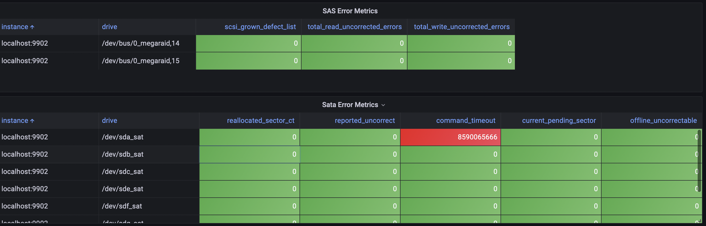

# Prometheus S.M.A.R.T ctl metrics exporter


This is a simple exporter for the [Prometheus metrics](https://prometheus.io/) using [smartctl](https://www.smartmontools.org/). The script `smartprom.py` also comes with `smartprom.service` so that you can run this script in the background on your Linux OS via `systemctl`. The script will use port `9902`, you can change it by changing it directly in the script. This script exports all of the data available from the smartctl.


## Install

_Note: You don't have to do this if you use the Docker image._

1. Copy the `smartprom.service` file into `/etc/systemd/system` folder.
2. Copy the `smartprom.py` file anywhere into your system.
3. Modify `ExecStart=` in the `smartprom.service` so that it points to `smartprom.py` in your system.
4. Run `chmod +x smartprom.py` 
5. Install `prometheus_client` for the root user, example: `sudo -H python3 -m pip install prometheus_client`
6. Run `systemctl enable smartprom` and `systemctl start smartprom`
7. Your metrics will now be available at `http://localhost:9902`

## Docker usage

No extra configuration needed, should work out of the box. The `privileged: true` is required in order for `smartctl` to be able to access drives from the host.

Docker image is here: <https://hub.docker.com/r/vaa12345/prometheus-smartctl>

Example docker-compose.yml:

```yml
version: '3'
services:
  prometheus_smartctl-exporter:
      image: vaa12345/prometheus-smartctl:latest
      container_name: prometheus_smartctl-exporter
      privileged: true
      volumes:
        - prometheus-smartctl_exporter:/etc/smartprom/
      ports:
        - 9902:9902
      restart: always
```

Your metrics will be available at <http://localhost:9902/metrics>

The exported metrics looks like these:

```shell
smartprom_smart_passed{drive="/dev/sda",model_family="Seagate BarraCuda 3.5 (SMR)",model_name="ST6000DM003-2CY296",serial_number="WCT362XM",type="sat"} 1.0
smartprom_raw_read_error_rate{drive="/dev/sda",model_family="Seagate BarraCuda 3.5 (SMR)",model_name="ST6000DM003-2CY296",serial_number="WCT362XM",type="sat"} 83.0
smartprom_raw_read_error_rate_raw{drive="/dev/sda",model_family="Seagate BarraCuda 3.5 (SMR)",model_name="ST6000DM003-2CY296",serial_number="WCT362XM",type="sat"} 2.23179896e+08
smartprom_power_on_hours{drive="/dev/sda",model_family="Seagate BarraCuda 3.5 (SMR)",model_name="ST6000DM003-2CY296",serial_number="WCT362XM",type="sat"} 73.0
smartprom_power_on_hours_raw{drive="/dev/sda",model_family="Seagate BarraCuda 3.5 (SMR)",model_name="ST6000DM003-2CY296",serial_number="WCT362XM",type="sat"} 24299.0
smartprom_airflow_temperature_cel{drive="/dev/sda",model_family="Seagate BarraCuda 3.5 (SMR)",model_name="ST6000DM003-2CY296",serial_number="WCT362XM",type="sat"} 60.0
smartprom_airflow_temperature_cel_raw{drive="/dev/sda",model_family="Seagate BarraCuda 3.5 (SMR)",model_name="ST6000DM003-2CY296",serial_number="WCT362XM",type="sat"} 40.0
...
```

## Configuration

All configuration is done with environment variables.

- `SMARTCTL_REFRESH_INTERVAL`: (Optional) The refresh interval of the metrics. A larger value reduces CPU usage. The default is `60` seconds.
- `SMARTCTL_EXPORTER_PORT`: (Optional) The address the exporter should listen on. The default is `9902`.
- `SMARTCTL_EXPORTER_ADDRESS`: (Optional) The address the exporter should listen on. The default is to listen on all addresses.

For disks that are not specified in the config, metrics will not be collected. In some cases, smartctl determines disk type incorrectly (for example, if sata disk is connected to a disk shelf via an interposer). You can specify disk type via config directly. 

Example smartprom.yml:

```yml
smartctl_exporter:
  devices:
    - /dev/sda: sat
    - /dev/sdb: sat
    - /dev/sdc: sat
    - /dev/sde: sat
    - /dev/sdf: sat
    - /dev/sdg: sat
    - /dev/sdh: sat
    - /dev/sdi: sat
    - /dev/bus/0: megaraid,14
    - /dev/bus/0: megaraid,15
```

## Grafana dashboard

There is a reference Grafana dashboard in [grafana/grafana_dashboard.json](./grafana/grafana_dashboard.json).



